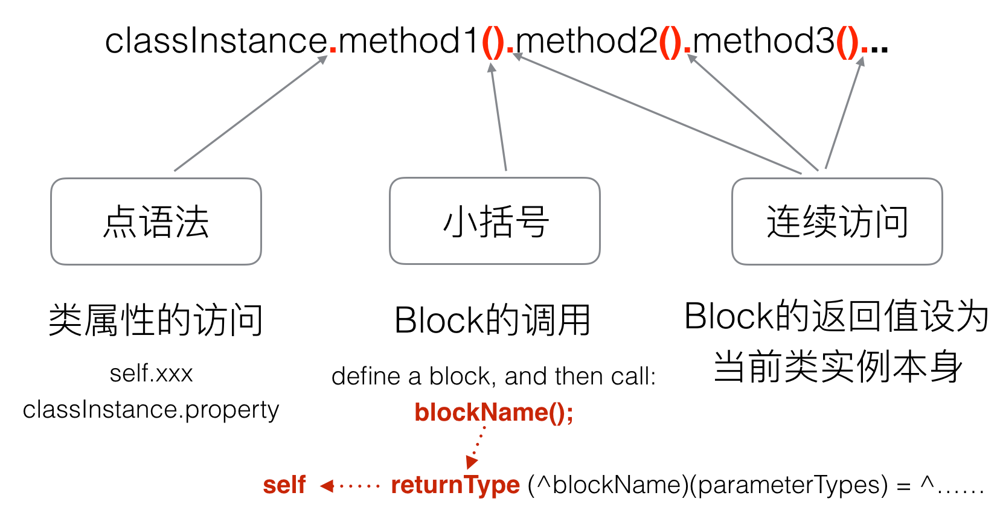

# iOS链式编程

iOS中关于链式编程最直接的参考框架就是自动布局的框架[Masonry](https://github.com/SnapKit/Masonry),我们简单看一下它官方给出的例子:

```objc
UIEdgeInsets padding = UIEdgeInsetsMake(10, 10, 10, 10);

[view1 mas_makeConstraints:^(MASConstraintMaker *make) {
    make.top.equalTo(superview.mas_top).with.offset(padding.top); //with is an optional semantic filler
    make.left.equalTo(superview.mas_left).with.offset(padding.left);
    make.bottom.equalTo(superview.mas_bottom).with.offset(-padding.bottom);
    make.right.equalTo(superview.mas_right).with.offset(-padding.right);
}];
```

## 实现
实现的分析个人觉得这篇文章已经写的很不错了[谈谈 Objective-C 链式语法的实现](https://kangzubin.com/objective-c-chainable-syntax/),直接引用了其中的一张调用图如下：




## 计算器例子

### OC实现
首先封装计算器的类：

```objc
#import <Foundation/Foundation.h>

@interface XZCalculator : NSObject

@property (assign, nonatomic) NSInteger result;

- (XZCalculator *(^)(NSInteger num))add;

- (XZCalculator *(^)(NSInteger num))minus;

- (XZCalculator *(^)(NSInteger num))multiply;

- (XZCalculator *(^)(NSInteger num))divide;

@end
```

```
#import "XZCalculator.h"

@implementation XZCalculator

- (XZCalculator *(^)(NSInteger num))add{
    return ^(NSInteger num){
        _result += num;
        NSLog(@"result %d",_result);
        return self;
    };
}

- (XZCalculator *(^)(NSInteger num))minus{
    return ^(NSInteger num){
        _result -= num;
        NSLog(@"result %d",_result);
        return self;
    };
}


- (XZCalculator *(^)(NSInteger num))multiply{
    return ^(NSInteger num){
        _result *= num;
        NSLog(@"result %d",_result);
        return self;
    };
}


- (XZCalculator *(^)(NSInteger num))divide{
    return ^(NSInteger num){
        _result /= num;
        NSLog(@"result %d",_result);
        return self;
    };
}

@end
```

**测试代码:**

```objc
XZCalculator *calculator = [[XZCalculator alloc] init];
calculator.add(10).minus(5).multiply(3).divide(5);
```

**执行结果**

```
2017-11-07 10:05:07.123349+0800 CalculatorForOC[5815:231724] result 10
2017-11-07 10:05:07.123559+0800 CalculatorForOC[5815:231724] result 5
2017-11-07 10:05:07.123678+0800 CalculatorForOC[5815:231724] result 15
2017-11-07 10:05:07.123775+0800 CalculatorForOC[5815:231724] result 3
```

做一个`NSObject`的分类继续简化调用：

```objc
#import <Foundation/Foundation.h>
#import "XZCalculator.h"

@interface NSObject (XZCalculator)

- (void)xz_makeCalculation:(void(^)(XZCalculator *calculator))block;

@end
```

```objc
#import "NSObject+XZCalculator.h"

@implementation NSObject (XZCalculator)

- (void)xz_makeCalculation:(void(^)(XZCalculator *calculator))block{
    XZCalculator *calculator = [[XZCalculator alloc] init];
    block(calculator);
}
@end
```

**测试代码:**

```
[self xz_makeCalculation:^(XZCalculator *calculator) {
    calculator.add(10).minus(5).multiply(3).divide(5);
}];
```

**执行结果:**

```
2017-11-07 10:13:33.999146+0800 CalculatorForOC[6047:253166] result 10
2017-11-07 10:13:33.999304+0800 CalculatorForOC[6047:253166] result 5
2017-11-07 10:13:33.999405+0800 CalculatorForOC[6047:253166] result 15
2017-11-07 10:13:33.999497+0800 CalculatorForOC[6047:253166] result 3
```

### Swift实现

swift中函数的调用方式就是使用`.(参数)`的方式，因此实现没必要使用`OC`中的闭包去实现，具体实现例子参考如下：

```
import UIKit

class XZCalculator: NSObject {
    
    var result:Int = 0;

    func add(_ num:Int) -> XZCalculator {
        self.result += num;
        print("result \(self.result)");
        return self;
    }
    
    func minus(_ num:Int) -> XZCalculator {
        self.result -= num;
        print("result \(self.result)");
        return self;
    }
    
    func multiply(_ num:Int) -> XZCalculator {
        self.result *= num;
        print("result \(self.result)");
        return self;
    }
    
    func divide(_ num:Int) -> XZCalculator {
        self.result /= num;
        print("result \(self.result)");
        return self;
    }
}
```

**测试代码**

```swift
let calculator:XZCalculator = XZCalculator();
calculator.add(10).minus(5).multiply(3).divide(5);
```

**执行结果**

```
result 10
result 5
result 15
result 3
```

同样我们做一个`NSObject`的扩展继续简化调用：

```swift
import Foundation

extension NSObject {
    func xz_makeCalculation(_ block:(_ calculator:XZCalculator) -> ()){
        let calculator:XZCalculator = XZCalculator();
        block(calculator);
    }
}
```

**测试代码**

```swift
self.xz_makeCalculation { (calculator:XZCalculator) in
    calculator.add(10).minus(5).multiply(3).divide(5);
};
```

**执行结果**

```
result 10
result 5
result 15
result 3
```

## 参考文章
- [谈谈 Objective-C 链式语法的实现](https://kangzubin.com/objective-c-chainable-syntax/)